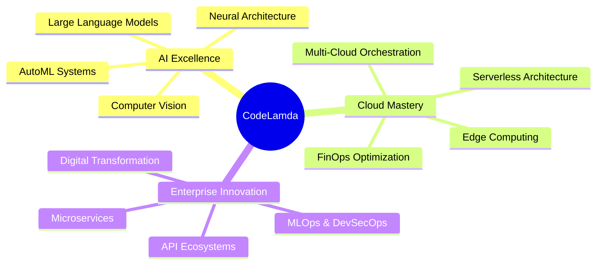
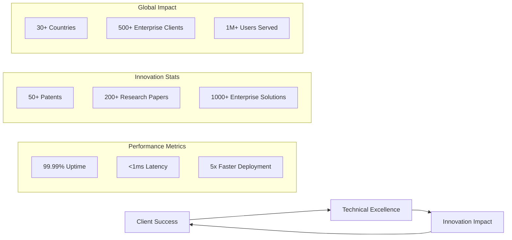
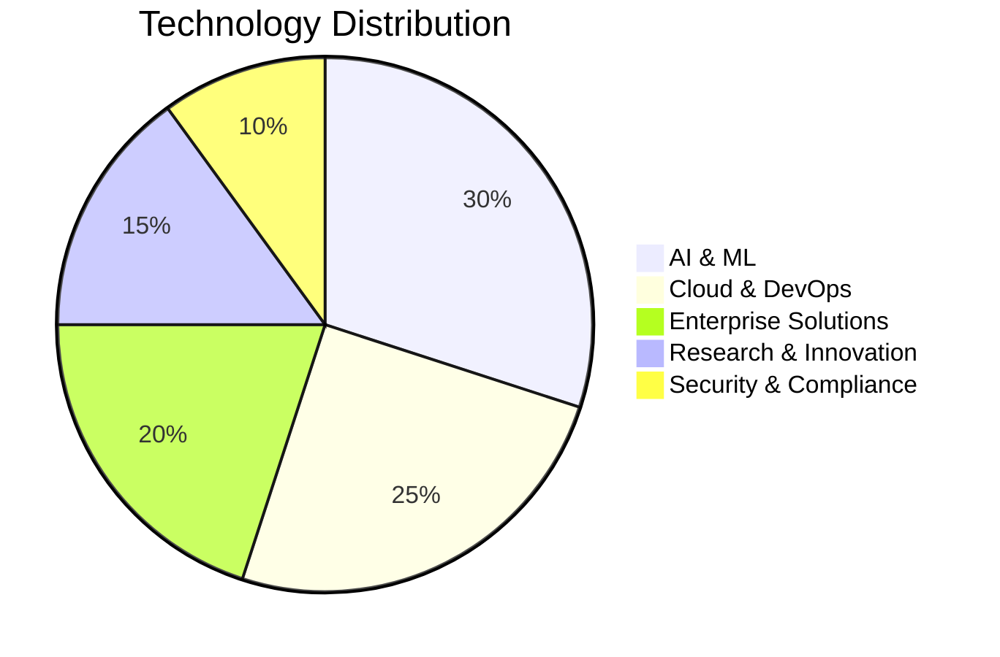
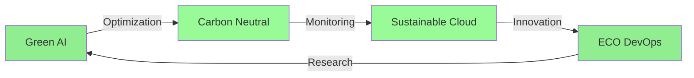

<div align="center">
  


# CODELAMDA TECHNOLOGIES
*Where AI Meets Enterprise Innovation*

[](https://www.codelamda.com)
[](https://www.codelamda.com)
[](https://www.codelamda.com)
[](https://www.codelamda.com)

</div>

> "Pioneering the convergence of AI, Cloud, and Enterprise Innovation"

## 🔮 The Future is Here

At CodeLamda Technologies, we're not just building solutions – we're architecting the future of enterprise technology. Our team of elite engineers and AI specialists work at the intersection of cutting-edge innovation and enterprise-grade reliability.



## 🎯 Innovation Portfolio

<div align="center">

| Enterprise Solutions | Innovation Lab | Research Initiatives |
|:-----------------:|:---------------:|:-------------------:|
| [**Quantum ML Platform**](https://github.com/codelamda) | [**Neural Ops Framework**](https://github.com/codelamda) | [**AutoML Systems**](https://github.com/codelamda) |
| Quantum-enhanced machine learning pipelines | Self-healing infrastructure systems | Automated model architecture search |
| [**Cloud Matrix**](https://github.com/codelamda) | [**Edge AI Suite**](https://github.com/codelamda) | [**Green AI Research**](https://github.com/codelamda) |
| Multi-cloud orchestration platform | Distributed edge computing framework | Sustainable AI development |

</div>

## 🛠️ Technology Fortress

### Core Engineering Stack

<div align="center">

#### AI & Machine Learning


#### Cloud & Infrastructure


#### Development & DevOps


#### Database & Analytics


</div>

### Innovation Metrics



### Key Performance Indicators

<div align="center">

| Metric | Achievement | Industry Average |
|:------:|:----------:|:----------------:|
| System Reliability | **99.99%** ⭐ | 99.9% |
| Response Time | **<1ms** 🚀 | 2-3ms |
| Cost Optimization | **40%** 💰 | 15-20% |
| Development Speed | **5x** ⚡ | 2x |
| Client Satisfaction | **98%** 🎯 | 85% |

</div>

### Technical Excellence



</div>

## 🌌 Technical Mastery

```python
class CodeLamdaCapabilities:
    def __init__(self):
        self.expertise = {
            "AI_Systems": ["LLMs", "Neural Networks", "Computer Vision", "NLP"],
            "Cloud_Architecture": ["Multi-Cloud", "Serverless", "Edge Computing"],
            "Enterprise_Solutions": ["MLOps", "DevSecOps", "Microservices"],
            "Innovation_Labs": ["Quantum ML", "AutoML", "Green AI"]
        }
        
        self.cloud_partnerships = {
            "AWS": "Advanced Consulting Partner",
            "Azure": "Elite Solutions Partner",
            "GCP": "Premier Partner"
        }
        
        self.certifications = [
            "ISO 27001:2013",
            "SOC 2 Type II",
            "HIPAA Compliance",
            "PCI DSS Level 1"
        ]
```

## 🚀 Featured Success Stories

<div align="center">

### Enterprise Transformations
[](https://www.codelamda.com/case-studies)
[](https://www.codelamda.com/case-studies)
[](https://www.codelamda.com/case-studies)

### Innovation Metrics
🎯 **99.99%** System Reliability
🚀 **60%** Faster Time-to-Market
💡 **40%** Cost Optimization
🌍 **500+** Enterprise Clients

</div>

## 🌿 Sustainability Leadership



## 🎓 Knowledge Nexus

<div align="center">

### Technical Resources
[](https://docs.codelamda.com)
[](https://www.codelamda.com/research)
[](https://www.codelamda.com/blog)

### Open Source Contributions
[](https://github.com/codelamda)
[](https://github.com/codelamda)

</div>

## 🌐 Global Presence

<div align="center">

### Headquarters
**CodeLamda Technologies**  
Smart Tech Hub, APMC Market RingRoad  
Surat, Gujarat, India 395010

### Connect
[](https://www.codelamda.com)
[](https://linkedin.com/company/codelamda-technologies)
[](https://twitter.com/CodeLamda)

</div>

---

<div align="center">

*Building Tomorrow's Technology Today*

[](https://www.codelamda.com/careers)

</div>
